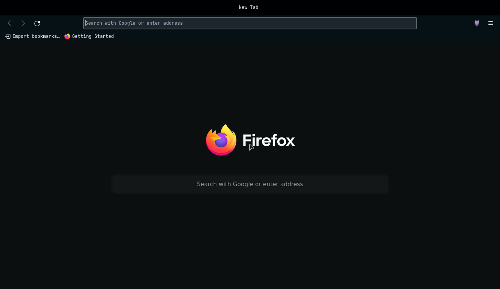

# Night for Firefox

Night is now available for firefox too

## Usage

### [Firefox Color](https://color.firefox.com)

> May require the [Firefox Color extension](https://addons.mozilla.org/en-US/firefox/addon/firefox-color/)

Then import this [theme](https://color.firefox.com/?theme=XQAAAAI0AQAAAAAAAABBqYhm849SCia3ftKEGccwS-xMDPrxTQSHTzD0xXdJQ7zpewX9bHnUYKLtMLCrmV8lKZ-hBHjOvo23dMZX7MElWQCT0xmOC8mG_0F9e2Mt97HTdSrl7adbPtzcElWxkNqiGGTvadox5FsKVfW4HjbBNEoEEfz2oISiuiK_2VwEH3yJVuMRs4NYTLZ1EOWDK-Q5zsZmrUBTkQjbl-Dpf7UBMWpMdgU26o35uKf8eH6HQkVhPMCiAlgurb1qCFzOnqi6t4K_pnrtjXjpsf_ua0ns)

### Using userChrome.css

1. Set `toolkit.legacyUserProfileCustomizations.stylesheets` to `true` in `about:config`

2. Copy the files from [firefox-css](https://github.com/NightCS/firefox/tree/main/firefox-css) to
`~/.mozila/firefox/*.default-release/chrome` or `~/.mozilla/firefox/*.default-default/chrome`
